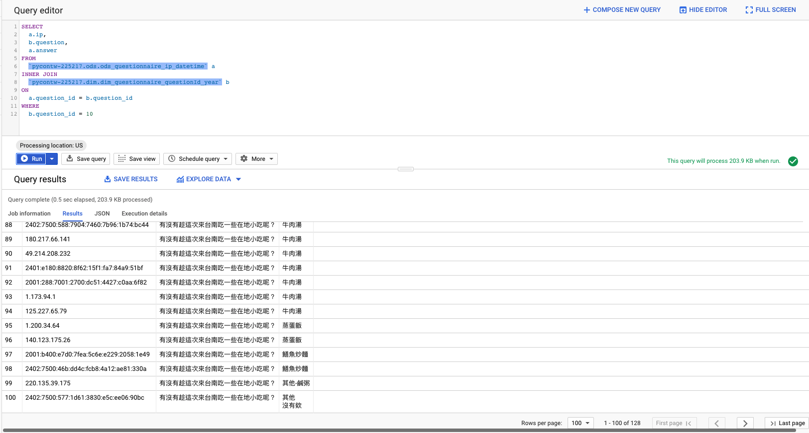

# PyCon Data Strategy Team Bootcamp

- [PyCon Data Strategy Team Bootcamp](#pycon-data-strategy-team-bootcamp)
  * [BigQuery](#bigquery)
    + [Example](#example)

<small><i><a href='http://ecotrust-canada.github.io/markdown-toc/'>Table of contents generated with markdown-toc</a></i></small>

## BigQuery

> 請注意！BigQuery 的收費方式是根據查詢的資料量計價，如果你不需要一次看那麼多資料
> 1. 請加上 _PARTITIONTIME，他會限制 BigQuery 掃描的 partition 避免帳單爆掉
> 2. 不要用 select *, please specify the column you're interested in!

1. 跟 @david30907d 要 BigQuery 權限（or 其他資深的大大）
2. 在你的 Query 加上 `_PARTITIONTIME` 的 condition
3. Run Query

### Example

```sql
SELECT
  a.ip,
  b.question,
  a.answer
FROM
  `pycontw-225217.ods.ods_questionnaire_ip_datetime` a
INNER JOIN
  `pycontw-225217.dim.dim_questionnaire_questionId_year` b
ON
  a.question_id = b.question_id
WHERE
  DATE(a._PARTITIONTIME) = "2020-09-28"
  AND DATE(b._PARTITIONTIME) = "2020-09-28"
  AND b.question_id = 10
```

